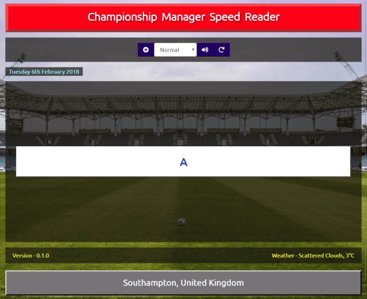

# Championship Manager Speed Reader

A `Championship Manager` inspired speed reader web application, written using modern web technologies (ReactJS, Redux, Bootstrap 4, etc).

## What is Championship Manager

`Championship Manager` was a football management simulator computer game, that I wasted many hours playing during the course of my younger years. It used a commentary text based system to show live highlights of a match.

## What is a speed reader

Software that aids in improving your ability to read quickly. Splits the long passage of text in to smaller readable chunk.

## Why

The idea came about as I remembered spending many hours playing the football management game `Championship Manager` on my Amiga back in the day and had recently been made aware that `Championship Manager 01/02` was now [abandonware]( https://www.fmscout.com/a-championship-manager-0102-free-download.html) and free to install.

It used a commentary text based system to show live highlights of a match. After installing and playing for a few minutes (probably hours), I was intrigued by the text commentary that was used. Text was flashed within a block in the centre on the screen and the speed could be adjusted (very slow, slow, normal, fast and very fast) and found I could quickly read the commentary.

I'd seen similar web apps that can be used to train speed reading using this technique (for reference, a speed reader is software that aids in improving your ability to read quickly as it splits the long passage of text into smaller chunks).

So I decided to combine the two in my demo project to provide a public showcase of some of the web development knowledge and skills that I’ve collated over the years.

## Demo

http://www.cm-speed-reader.co.uk

## License

This project is licensed under the MIT License - see the [LICENSE](LICENSE) file for details.
